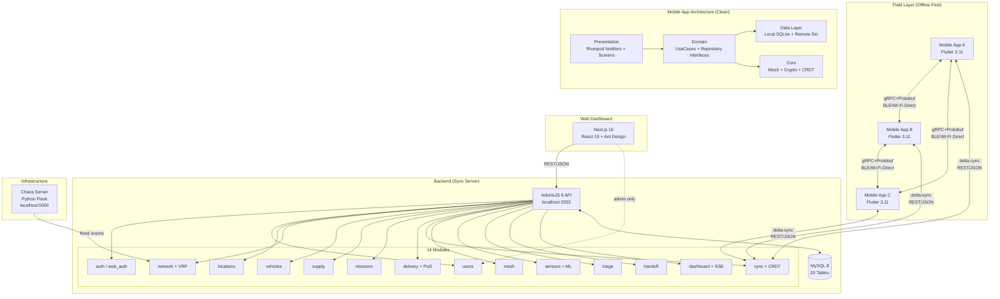
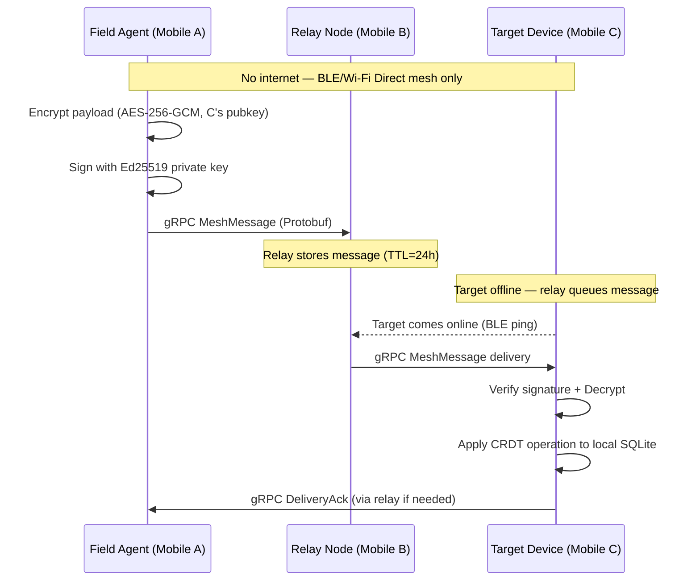
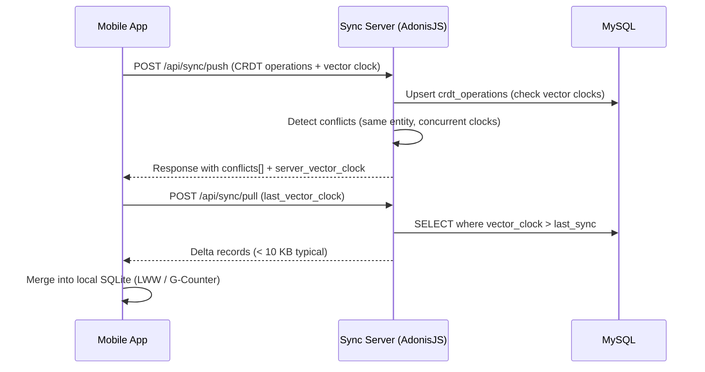
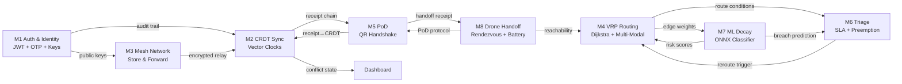
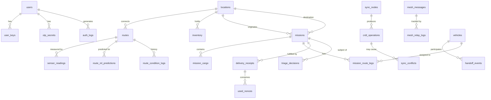
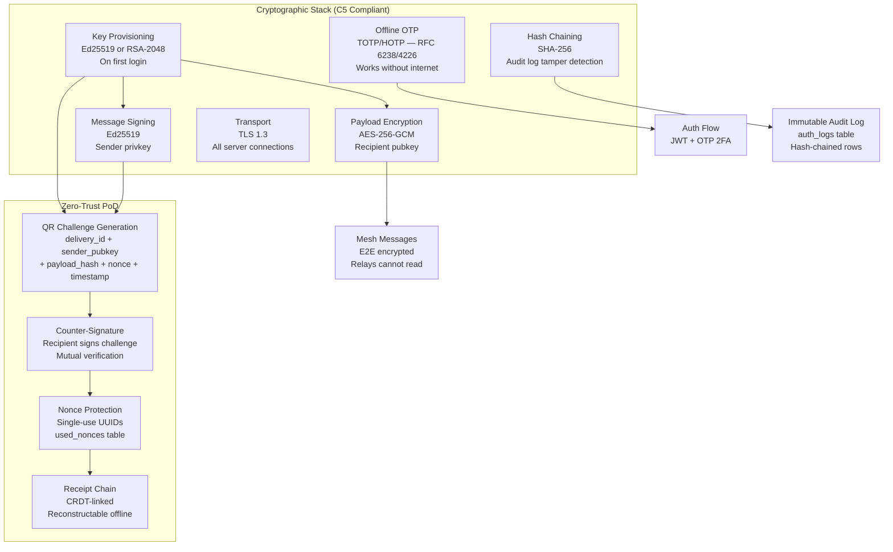

# Digital Delta — System Architecture

> HackFusion 2026 | Track: Advanced Systems & Disaster Resilience

---

## 1. High-Level System Overview

```
┌─────────────────────────────────────────────────────────────────────────────┐
│                         INTERNET (Available < 10% uptime)                   │
└──────────────────────────────────┬──────────────────────────────────────────┘
                                   │ REST/JSON (dashboard only, when online)
                    ┌──────────────▼──────────────┐
                    │     Web Dashboard (Next.js) │
                    │  Command & Control Center   │
                    │  localhost:3000             │
                    └──────────────┬──────────────┘
                                   │ REST/JSON (C1 permitted for dashboard)
                    ┌──────────────▼──────────────┐
                    │   Backend Sync Server       │
                    │   AdonisJS 6 + MySQL 8      │
                    │   localhost:3333            │
                    │   14 REST modules           │
                    └──────────────┬──────────────┘
                                   │ delta-sync (when reachable)
          ┌────────────────────────┼──────────────────────┐
          │                        │                       │
┌─────────▼──────┐       ┌────────▼───────┐     ┌────────▼───────┐
│  Field Device A│       │ Field Device B │     │ Field Device C │
│  (Flutter App) │       │  (Flutter App) │     │  (Flutter App) │
│  SQLite + CRDT │       │  SQLite + CRDT │     │  SQLite + CRDT │
│  Offline-first │       │  Offline-first │     │  Offline-first │
└────────┬───────┘       └────────┬───────┘     └────────┬───────┘
         │                        │                       │
         │         gRPC + Protobuf (MANDATORY — C1)       │
         │      ◄──── BLE / Wi-Fi Direct Mesh ────►       │
         │                        │                       │
         └────────────────────────┴───────────────────────┘
                    AD-HOC MESH NETWORK (No Wi-Fi router required)
```

---

## 2. Component Architecture



---

## 3. Data Flow — Offline vs Online Modes

### Mode A: Fully Offline (80% of operation time)



### Mode B: Online Sync (when internet available)



---

## 4. Module Interaction Map



---

## 5. Database Schema Overview



---

## 6. Security Architecture



---

## 7. CAP Theorem Trade-Off

Digital Delta operates as a distributed system across disconnected mobile devices. We explicitly chose:

### Decision: **AP (Availability + Partition Tolerance)**

> We sacrifice **Consistency** in favor of **Availability** and **Partition Tolerance**.

**Justification:**

In a disaster response scenario:

- **Network partitions are the norm**, not the exception — cellular infrastructure is collapsed
- **Availability is life-critical** — a field volunteer who cannot record a supply handoff because the system is "waiting for consensus" creates direct harm
- **Eventual consistency is acceptable** — supply inventory discrepancies are tolerable and resolvable; a 10-minute conflict window does not endanger lives

**How we achieve this with CRDT:**

| Challenge                                 | Solution                                                                             |
| ----------------------------------------- | ------------------------------------------------------------------------------------ |
| Concurrent writes on disconnected devices | LWW-Register (Last-Write-Wins) with vector clock timestamps                          |
| Conflicting inventory counts              | G-Counter CRDT for additive fields (only increments; never lose counts)              |
| Causal ordering                           | Lamport vector clocks on every `crdt_operation` record                               |
| Conflict detection                        | Server detects same `entity_id` + concurrent vector clocks on reconnect              |
| Resolution                                | UI surfaces both values; camp commander resolves; decision logged                    |
| Convergence guarantee                     | All nodes reach identical state after sync; mathematically proven by CRDT properties |

**CAP boundary:**

- During partition: **Available** (all CRUD works locally, mesh relays messages)
- On reconnect: **Eventually Consistent** (delta-sync merges diverged state)
- Never provides **Strong Consistency** — acceptable for this domain

---

## 8. Offline vs Online Feature Matrix

| Feature           | Fully Offline         | Mesh-Only          | Online Sync  |
| ----------------- | --------------------- | ------------------ | ------------ |
| Login (OTP)       | ✅ TOTP works offline | ✅                 | ✅           |
| Create mission    | ✅ SQLite             | ✅ via mesh relay  | ✅           |
| VRP routing       | ✅ cached graph       | ✅                 | ✅           |
| PoD handshake     | ✅ Ed25519 local      | ✅                 | ✅           |
| CRDT sync         | ✅ local merge        | ✅ delta over mesh | ✅ full sync |
| ML prediction     | ✅ ONNX on-device     | ✅                 | ✅           |
| Triage preemption | ✅ local engine       | ✅                 | ✅           |
| Drone rendezvous  | ✅ geometric compute  | ✅                 | ✅           |
| Dashboard charts  | ❌ requires browser   | ❌                 | ✅           |
| Audit log view    | ✅ local log          | limited            | ✅ full      |

---

## 9. Technology Stack Summary

| Layer               | Technology                  | Version         | Notes                    |
| ------------------- | --------------------------- | --------------- | ------------------------ |
| Mobile Client       | Flutter                     | 3.11.1          | iOS + Android            |
| State Management    | Riverpod                    | 2.6.1           | Provider + AsyncNotifier |
| Mobile DB           | SQLite                      | 3 (via sqflite) | CRDT layer on top        |
| Backend Framework   | AdonisJS                    | 6.18            | TypeScript, MVC          |
| Backend DB          | MySQL                       | 8.x             | 20 tables, 9 migrations  |
| ORM                 | Lucid (AdonisJS)            | 21.6            |                          |
| Web Framework       | Next.js                     | 16.2.3          | App Router               |
| UI Library          | Ant Design                  | 6.3.5           |                          |
| Inter-node Protocol | gRPC + Protobuf             | proto3          | C1 mandatory             |
| BLE Mesh            | flutter_reactive_ble        | 5.x             | + Bridgefy               |
| Crypto (mobile)     | pointycastle + cryptography | 3.9.1 / 2.8     |                          |
| ML Runtime          | ONNX Runtime (mobile)       | —               | On-device inference      |
| Route Visualization | Leaflet.js + OSM            | —               | Pre-cached tiles         |
| Monorepo            | Turborepo + pnpm            | 2.6.1 / 9       |                          |

---

## 10. Deployment Architecture (Local / Demo)

```
localhost:3333  →  AdonisJS API (REST/JSON, for dashboard)
localhost:3000  →  Next.js Dashboard
localhost:5000  →  Chaos Server (Python Flask)

Mobile App     →  Flutter (physical device or emulator)
Mesh Network   →  BLE + Wi-Fi Direct (device-to-device)
```

All components run **locally with no cloud dependency**. The system is designed for:

- 2 physical Android devices for BLE mesh demo
- 1 laptop running all server processes
- MySQL running locally (no Docker required for demo, optional)
